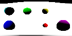
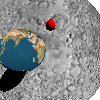

For this ray tracing assignment, I submitted a program that generates 3D imagery by reading a text file and producing an image file. The rays are emitted from an eye point, passing through a grid, and interacting with objects in the scene based on physically accurate ray-object collisions. I implemented basic illumination using Lambert's law and ensured rays hit the closest object in front of the eye, casting shadows where appropriate. The program correctly handles color conversions to sRGB and ensures that rays interact with objects in the expected manner, such as sphere collisions, overlaps, and shadows.

I completed the following features:

- Sphere: I successfully rendered spheres with random colors at specified positions, ensuring correct collisions and ray-object interactions.
- Sun: A directional light source (sun) was added to illuminate the scene, contributing to the realistic lighting and shadowing.
- Color: I implemented color controls, allowing for precise specification of object colors using RGB values.
- Overlap: I ensured that rays interact with the closest object, even when multiple objects overlap.
- Shadows: The ray tracer correctly handles shadows, casting them from one object onto another without self-shadowing issues.
- Shadow Basic: Basic shadows were implemented, with objects casting shadows on each other in a physically accurate manner.
- Plane: I added planes to the scene, defining a 3D space with infinite planes satisfying specific equations.
- Triangle (trif): I added the ability to render triangles using ray tracing, creating more complex geometries in the scene.
- Multiple Suns (suns): The scene supports multiple light sources, contributing to more dynamic and realistic lighting scenarios.
- Bulb (Point Light): I implemented point lights (bulbs) with distance-based falloff, adding more nuanced lighting effects.
- Negative Light: I allowed for negative light sources that emit darkness, adding an interesting dynamic to the scene’s illumination.
- Shadow Bulb and Suns: Shadows were properly calculated for both sun and bulb lights, creating realistic shadow interactions in the scene.
- Shadow Triangle and Plane: I handled shadows cast by triangles and planes, ensuring all objects interact correctly with light sources.
- Exposure (Expose1, Expose2): I applied an exposure function to the scene, controlling brightness levels for better visual contrast.
- Textures (tex): I mapped textures onto spheres using latitude-longitude coordinates, enhancing the visual realism of objects.
- Eye, Forward, Up: I implemented camera controls, allowing the user to change the eye, forward, and up vectors to modify the view and camera orientation.
- Anti-Aliasing (aa): I added anti-aliasing, shooting multiple rays per pixel and averaging the results to smooth out jagged edges.
- Fisheye: I implemented a fisheye projection, distorting the rays to simulate a wide-angle lens effect.
- Panorama: I created a panoramic projection by treating the scene as a 360-degree environment.
- Depth of Field: I simulated depth of field using a lens and focal depth, where objects closer to the focal point appear sharp, and those farther away are blurred.

Some examples of generated images are 

    
    

    

The many spheres took close to 40 minutes on my PC to render, but the timing could be improved massively after using a BVH which i haven't gotten around to implementing yet.
